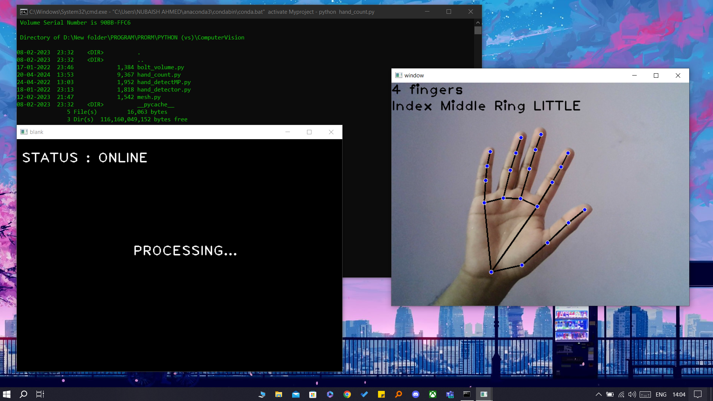
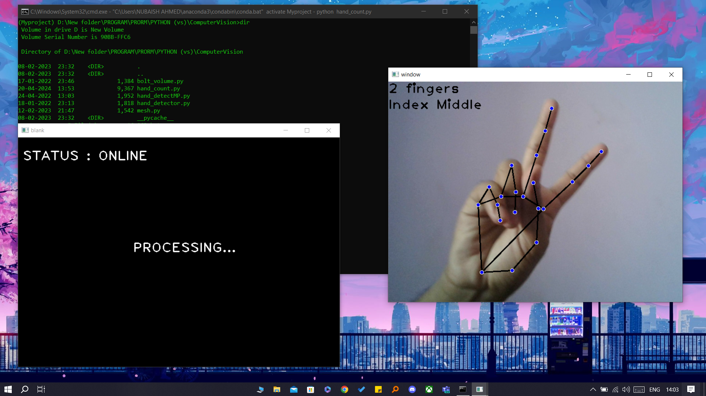

# GestureControl

GestureControl is an IoT device allowing users to control lights through hand gestures captured by a camera.

## Software and Tools

- **Languages**: Python, C++
- **Environments**: VS Code, Arduino IDE, Anaconda
- **Libraries**: mediapipe, cv2, pyfirmata, boltiot, numpy, requests

## Hardware Components

- Arduino UNO
- Wi-Fi Module
- Relay Module
- Indicators (lights & buzzer)


## Features

- **Gesture-Based Automation**: Control various devices and actions using hand gestures.
- **Intuitive Gestures**: Perform natural hand gestures to trigger specific commands.
- **Customizable Actions**: Define and customize actions corresponding to different gestures.
- **Power Alerting System**: Receive alerts for prolonged device usage.
- **Integration with Bolt IoT App and API**: Seamless communication and control.

## Setup

```bash
# Clone repository
git clone https://github.com/yourusername/GestureControl.git

# Navigate to project directory
cd GestureControl
```
```bash
# Install dependencies
pip install -r requirements.txt

# Upload Arduino code to Arduino UNO board
# Connect hardware according to schematic
# Run Python script
python main.py
```

## How it Works

1. **Capture Gestures**: Continuously capture hand gestures via live camera feed.
2. **Gesture Recognition**: Utilize computer vision techniques to recognize specific hand gestures.
3. **Communication with Arduino**: Send commands to Arduino via the COM interface for light control.
4. **Power Usage Monitoring**: Monitor duration when all lights are on. Alert user and send notification if exceeded threshold.

## Screenshots





## Video Demo

[Link to Video Demo](Resources/Demo.mp4)

## Contributing

Contributions welcome! Submit issues or pull requests to enhance GestureControl.

## License

This project is licensed under the MIT License.
